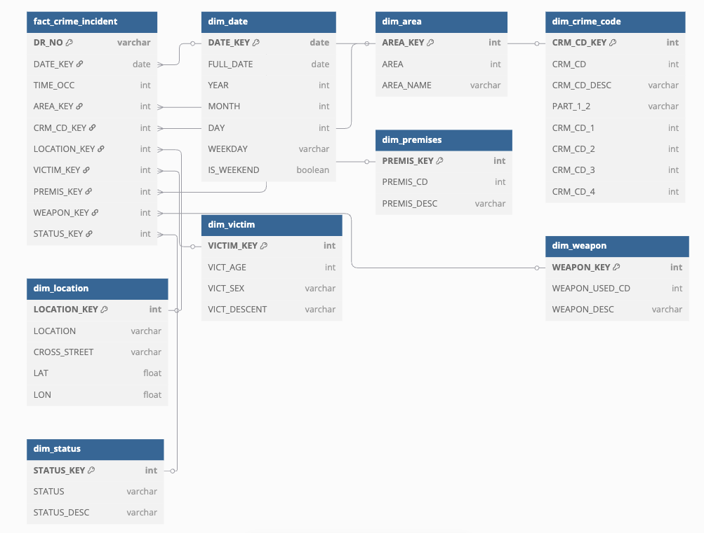

# lapd-crime-data-pipeline
End-to-end data project on LA crime data including modeling, transformation, quality checks, and analytics.

## 📐 Data Modeling

Used a star schema with one fact table and multiple dimensions for scalable analytics.

**ER Diagram:**  

**Schema Code:**  
View the source schema file [here](./data_model/lapd_star_schema.dbml)
