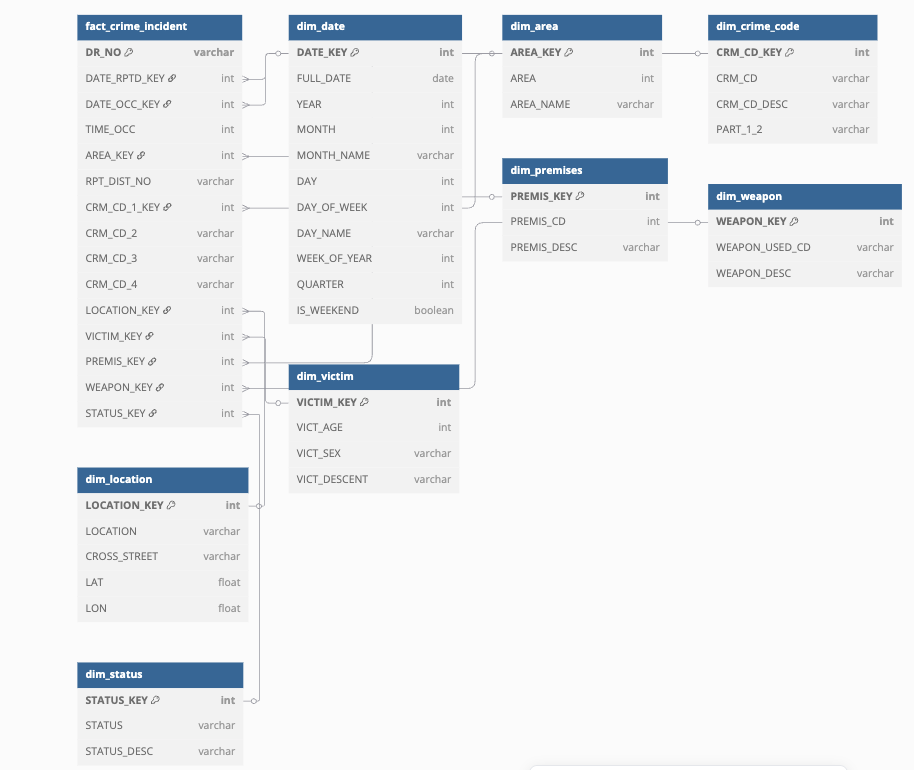

# lapd-crime-data-pipeline
End-to-end data project on LA crime data including modeling, transformation, quality checks, and analytics.

## 📐 Data Modeling
Used a star schema with one fact table and multiple dimensions for scalable analytics.

## 🧑‍💻 Data Modeling Choices
For this project, I chose to implement a **Star Schema** for the data warehouse. Here's why:
- **Simplicity and Performance**: The **Star Schema** provides a simple and efficient structure that supports fast queries for analytical reporting. It avoids the complexity of many-to-many relationships present in **Snowflake Schema**, making it a better fit for this project where reporting speed is essential.
- **Use Case Alignment**: The primary goal of this project is to create an efficient reporting pipeline for **crime data analysis**. The **Star Schema** allows for easy aggregations and calculations, ensuring that we can generate reports without performance degradation.
- **Why Not Snowflake?**: While the **Snowflake Schema** provides more normalization and reduces redundancy, it also introduces additional complexity and potential performance trade-offs due to multiple joins. Given the need for fast query execution in this project, **Star Schema** was a more practical choice.

**ER Diagram:**  

**Schema Code:**  
View the source schema file [here](./data_model/lapd_star_schema.dbml)
